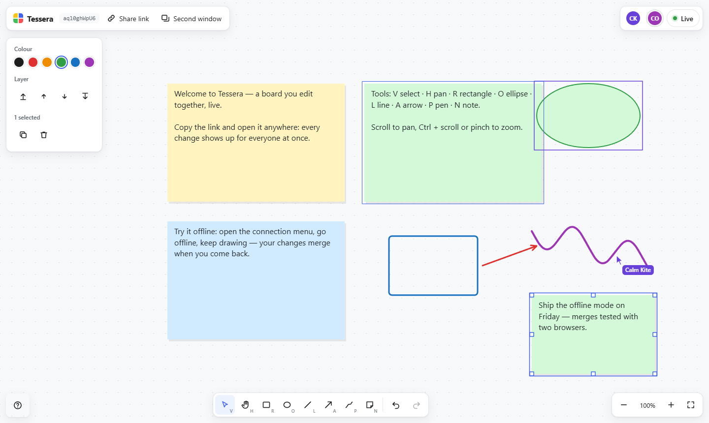

# Tessera — a multiplayer whiteboard, with the sync written from scratch

Draw on one board with other people in real time: live cursors, offline edits that merge when you
reconnect, and undo that only takes back your own changes. No sign-up — open the link on two devices,
or press **Second window**. Built as a portfolio project.

**[tessera.flytomars94.workers.dev](https://tessera.flytomars94.workers.dev)**

**React 19 · TypeScript · Vite · Canvas 2D · Cloudflare Workers · Durable Objects (SQLite) · Vitest · Playwright**



> No CRDT library, no realtime service. The interesting part is the synchronisation — ordering,
> conflicts, offline, exactly-once delivery — so that is the part written by hand, and the part the
> tests go after hardest.

## Try it

- Draw with the toolbar or the keys: **R** rectangle, **O** ellipse, **L** line, **A** arrow, **P** pen, **N** sticky note.
- **Share link** or **Second window**, and edit from both sides.
- Open the **Live** pill and choose **Go offline**. Keep drawing, then go back online — your changes
  merge with whatever happened meanwhile.
- `/bench` fills a local board with up to 20,000 shapes and flies the camera across it.

## How the sync works

```
editor ── optimistic change ──►  Durable Object (one per room)  ── change #seq ──►  everyone,
  ▲        (client id, n)         applies it once, in one order                      author included
  └──────────────── acknowledgement = its own change coming back with a number ────────┘
```

**The server's only job is order.** A Durable Object is single-threaded, so every change to a room is
applied in one sequence and broadcast with its number. Every client applies changes with the same
function ([`shared/doc.ts`](shared/doc.ts)), so the same changes in the same order give the same board.

**Conflicts resolve per property, not per shape.** A change sets properties; the later one in the
server's order wins for each property it touches. If you move a rectangle while someone recolours it,
both survive. This is the model Figma describes for its own multiplayer, and it is enough for a
whiteboard: there is no text that two people type into character by character, so no need for a
sequence CRDT.

**Edits show up instantly, and never flicker.** Each client keeps two boards: `confirmed` (the server's,
as of the last change it sent) and `view` (confirmed plus its own unacknowledged changes). A remote
write to a property this client is still waiting to hear back about is not shown: the server has
ordered it *before* ours, so ours is what the board ends up with — showing theirs in between would make
the shape jump back and forth. See [`src/sync/sync-client.ts`](src/sync/sync-client.ts).

**Exactly once, however often it is sent.** Each client numbers its changes; the room remembers the
last number it applied per client and says so when a client reconnects, so nothing is applied twice
and nothing already applied is re-sent.

**Offline is not a special mode.** While disconnected, changes queue exactly as they do online — they
are also written to `localStorage`, so a reload keeps them — and go out on reconnect. The server's
ordering then does the merging; no extra merge logic exists.

**Layer order without renumbering.** Stacking order is a fractional index
([`shared/fractional.ts`](shared/fractional.ts)): there is always a key between two keys, so moving a
shape to the front rewrites that one shape and nothing else. The first version used fractions only; a
test that kept putting a new shape on top pushed keys past the 64-character limit within a few hundred
inserts. Keys now carry an integer part, and ten thousand such inserts stay at four characters.

**Undo takes back only your own changes** — and only the properties you changed. It is computed as the
difference between the shapes before and after your action, so undoing your move does not also revert a
colour someone else set in the meantime.

## Proving it converges

[`src/sync/convergence.test.ts`](src/sync/convergence.test.ts) runs 2–4 simulated clients against the
real server logic through a hostile network: 120 seeded runs of 500 steps, with random delivery
interleavings, connections dropped with messages in flight, coalesced drags and a room small enough to
refuse changes. It checks two things:

- at the end, every client's board is exactly the server's;
- all along, every client's view equals *confirmed + its pending changes replayed* — the invariant the
  optimistic shortcuts rely on.

It found a real bug on its first run: `events.doc?.(this.applyRemote(change))` — an optional call does
not evaluate its arguments when there is no listener, so without a subscriber remote changes were never
applied at all.

The end-to-end suite ([`e2e/`](e2e)) runs against the real stack — the Worker and its Durable Objects
in workerd — and every test drives **two browsers**: a shape and a cursor crossing between them, a
recolour and a move of the same shape merging after one side was offline, offline edits surviving a
reload, undo leaving the other person's work alone, sticky-note text appearing as it is typed, and a
raw socket sending impersonated and malformed changes that the room turns away.

## Rendering

Canvas 2D, repainted only when something visible changed. Painting is exact, shape by shape, with
viewport culling and a single dot for anything under a pixel. Beyond that, every optimisation came from
a measurement:

| 10,000 shapes, one call each | Frame | JavaScript |
| --- | --- | --- |
| `strokeRect` | 34 ms | 1.8 ms |
| `roundRect` + `fill` + `stroke` | 89 ms | 9.3 ms |
| `ellipse` + `stroke` | 43 ms | 7.3 ms |
| `fillRect` | 6 ms | 1.9 ms |

The JavaScript is cheap; the frame is not. Every separate `fill()` or `stroke()` is its own operation
for the browser's GPU process. So:

- **Above 800 visible shapes, draw in batches**: one path per fill colour and one per stroke colour and
  width — a few dozen calls instead of ten thousand. The price is exact overlap order (fills go down
  before strokes), paid only when zoomed far enough out that shapes are a few pixels across.
- **Greeked text**: `fillText` under a zoom that changes every frame rasterises every glyph again at
  every size, so small or plentiful note text is drawn as grey bars of the right length.
- **Square corners when crowded**: `roundRect` costs several times what `strokeRect` does.
- **Order kept incrementally**: a drag never changes stacking order, so the sorted list is patched by
  binary search instead of re-sorted each frame.

Measured JavaScript time per frame while flying across the board: **1.1 ms** at 1,000 shapes,
**2.7 ms** at 5,000, **5.6 ms** at 10,000, **11 ms** at 20,000. Frame rate on top of that depends on
the GPU and whatever else it is doing, so run `/bench` on your own machine rather than trust a number
from mine.

## The server

[`worker/room.ts`](worker/room.ts): one Durable Object per room, using the WebSocket hibernation API —
a quiet room is evicted from memory while its sockets stay open.

- **Storage**: the room's own SQLite, written behind, once a second. A drag is dozens of changes a
  second to the same shape; writing each would spend the free tier's daily row writes in minutes.
  The trade-off: a crash can lose up to a second of edits.
- **Nothing unvalidated reaches the board** ([`shared/validate.ts`](shared/validate.ts)): known
  properties only, finite numbers within bounds, hex colours, capped text and points, at most 500
  operations per change. A client may only send changes under the id it said hello with.
- **Limits**: 50 connections and 3,000 shapes (about 6 MB) per room, a per-socket rate limit, same-origin
  sockets only, and rooms nobody opens for 30 days delete themselves.

## Honest limits

- Sticky-note text is last-writer-wins as a whole: two people typing into the same note at once will
  overwrite each other rather than merge character by character.
- Anyone with the link can edit. There are no accounts or permissions.
- Undo history lives in the tab and does not survive a reload.

## Running it

```bash
npm install
npm run dev          # one server: the editor through Vite, the rooms in workerd
npm test             # unit tests, including the convergence simulation
npm run test:e2e     # two-browser end-to-end tests against the real Worker
npm run lint
npm run typecheck
npm run deploy       # builds and deploys page and rooms together to Cloudflare
```

```
shared/   the protocol, document model, validation and room logic — used by both sides
worker/   the Worker entry point and the room Durable Object
src/      the editor: sync client, canvas renderer, tools, and the React chrome around them
e2e/      Playwright tests, each driving two browsers
```
